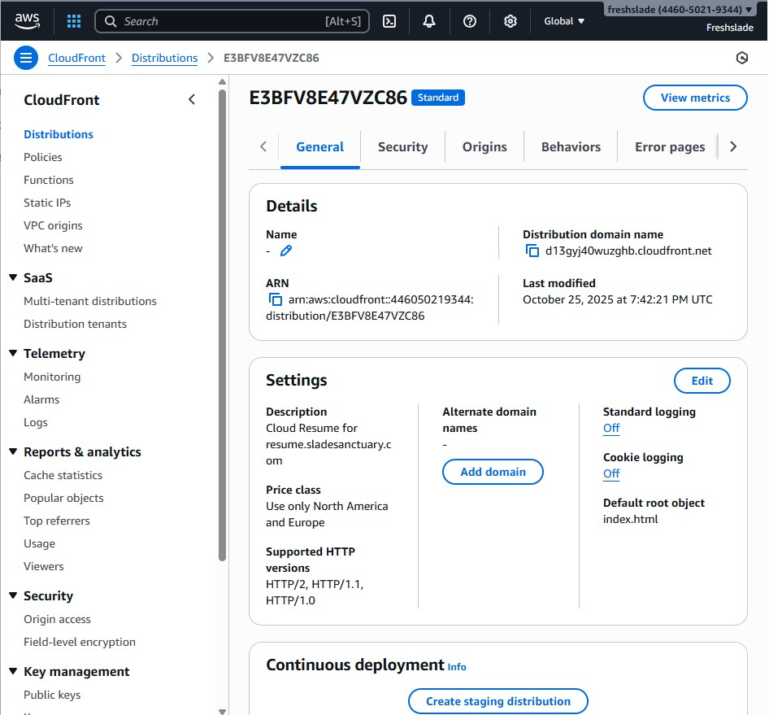
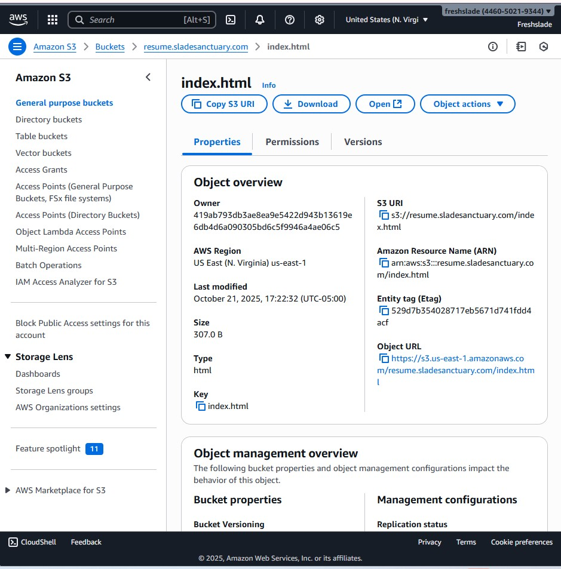
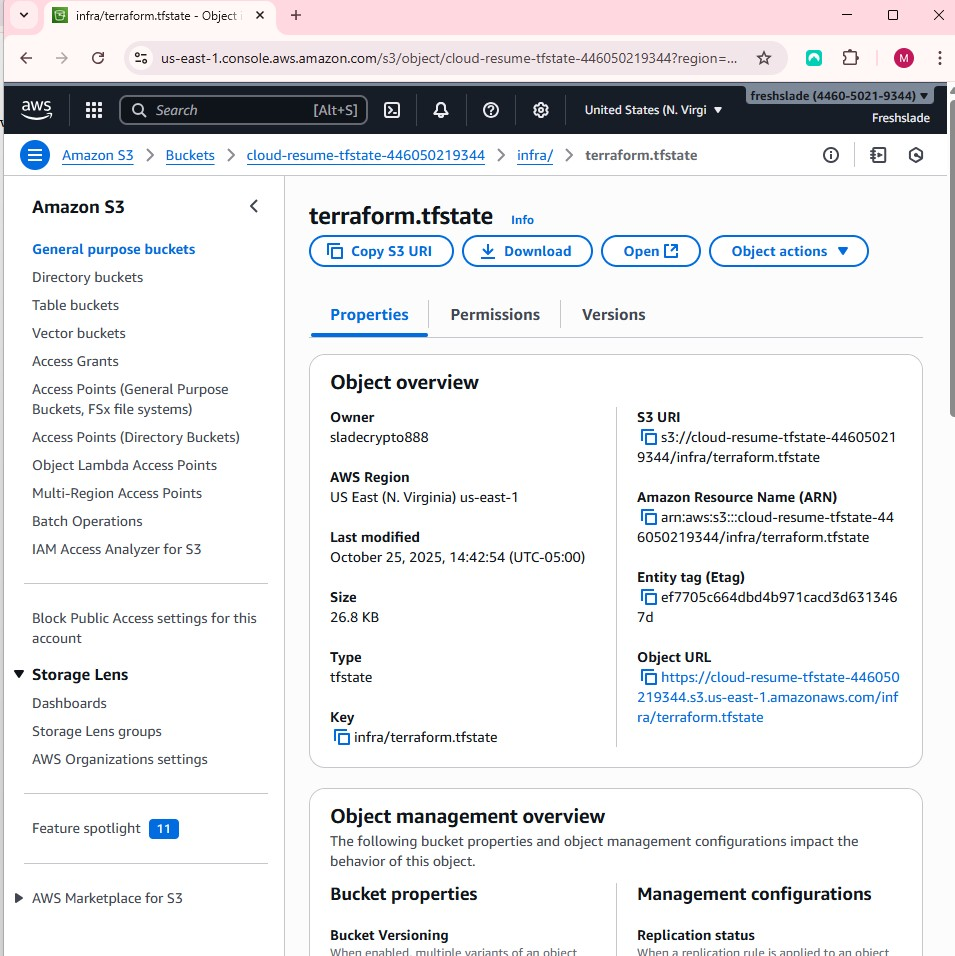
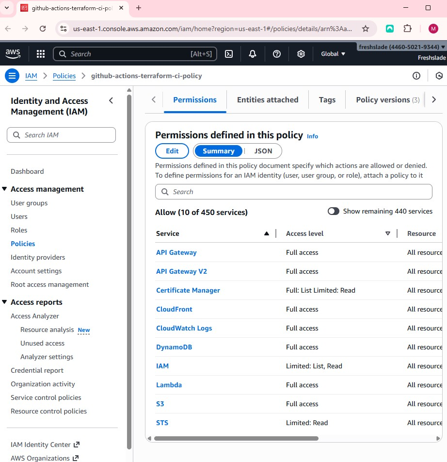
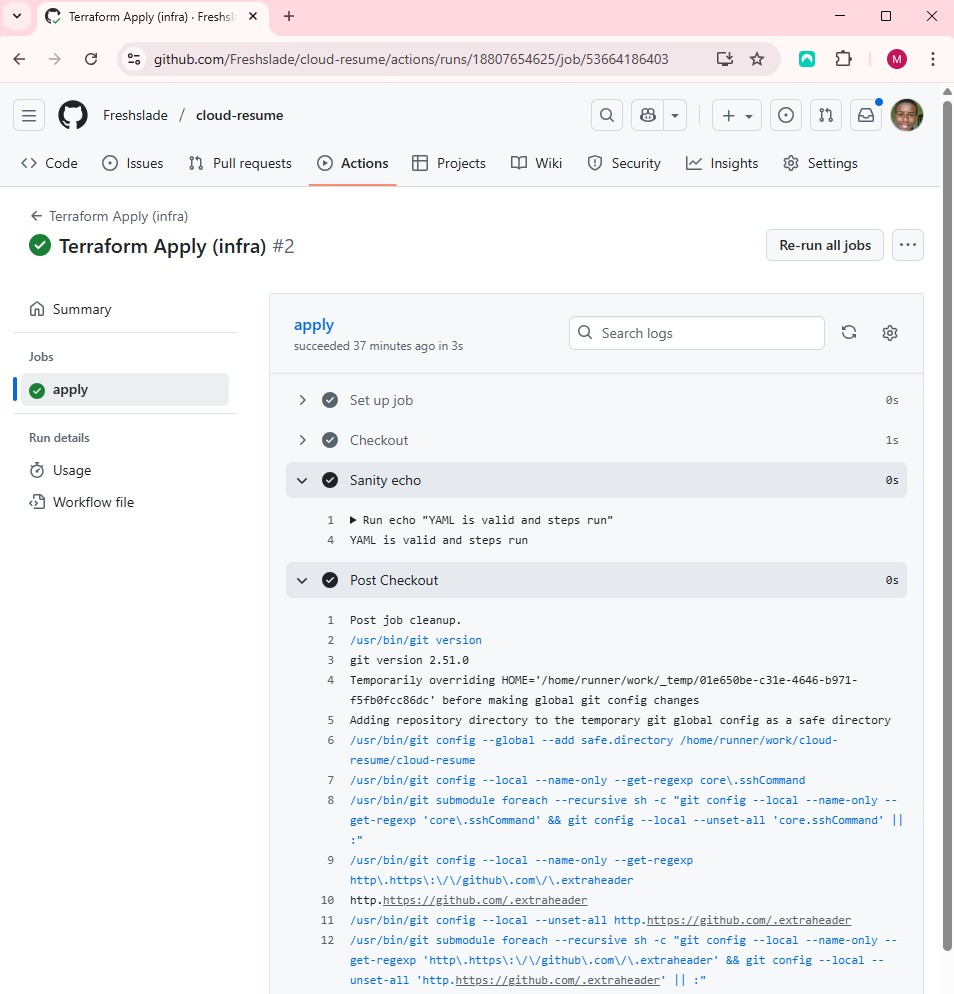

# ☁️ Cloud Resume Challenge — Automated with Terraform & AWS

This project is a fully automated deployment of a personal resume website hosted on AWS CloudFront + S3, with infrastructure managed via Terraform and continuous deployment handled by GitHub Actions using OpenID Connect (OIDC) for secure, keyless authentication.

I built this as my first end-to-end cloud automation project — not just to host a static site, but to prove I can design, provision, and automate a full-stack infrastructure from scratch.

🔗 Live site: https://d13gyj40wuzghb.cloudfront.net

---

## 🗂️ Project Architecture & Infrastructure

Below are key screenshots showing the infrastructure this project provisions and automates.

### ☁️ CloudFront Distribution
This is the CDN layer that delivers the static site globally and integrates with the S3 bucket through Origin Access Control (OAC).

### 🪣 S3 Static Website Hosting
Terraform created this S3 bucket for hosting the `index.html` file.

### 🔒 Remote Backend (S3 + DynamoDB)
Terraform stores its state remotely in S3, with DynamoDB used for state locking to prevent concurrent runs.

### 🔐 IAM OIDC Role for GitHub Actions
This IAM role and OpenID Connect provider allow GitHub Actions to deploy securely to AWS — no static access keys required.

### ⚙️ CI/CD Workflow
Here’s the Terraform Apply workflow running successfully in GitHub Actions.

---

### 🧭 What This Project Demonstrates
- End-to-end Infrastructure as Code with Terraform
- Secure remote backend (S3 + DynamoDB state locking)
- Automated deployment using GitHub Actions + OIDC
- Static hosting via S3 + CloudFront + ACM certificate
- Real-world DevOps pipeline workflows (`plan` + `apply`)
---

## 🧠 Lessons Learned

This project was a deep dive into real-world DevOps automation and problem solving.  
Here are a few things I took away from it:

- The importance of clean state management: Early on, I realized the value of remote state and locking — especially when refactoring infrastructure.
- Troubleshooting is the real teacher: Many of the errors I encountered (ACM certs, OIDC permissions, backend configs) forced me to slow down and understand why the system behaved that way.
- CI/CD doesn’t have to mean secrets: Using OpenID Connect between GitHub and AWS was an eye-opener — no credentials stored anywhere, yet full automation.
- Terraform isn’t just about infrastructure — it’s about reproducibility: I can now destroy and rebuild this entire stack with a single command.
- Confidence through iteration: I started this project feeling uncertain, but by working through each bug, I gained a much clearer mental model of AWS and Terraform integration.
---

### 🧾 Author
**Michael Slade**  
☁️ AWS Certified Solutions Architect • Terraform Certified • Cloud Enthusiast  
🔗 [GitHub](https://github.com/Freshslade) | [LinkedIn](https://www.linkedin.com/in/michael-slade-563545224/)

